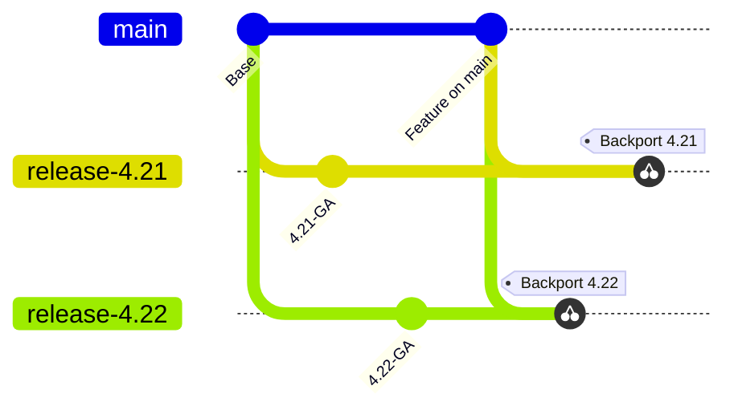
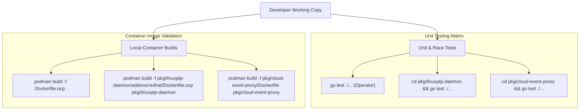
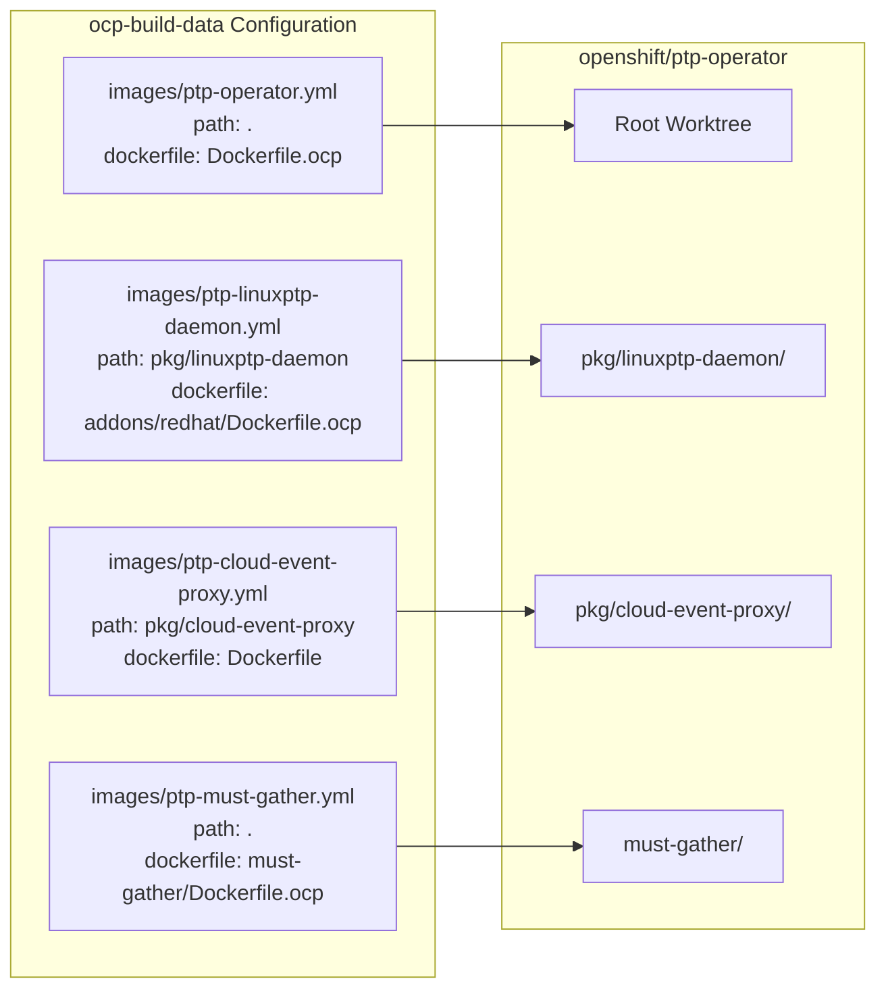
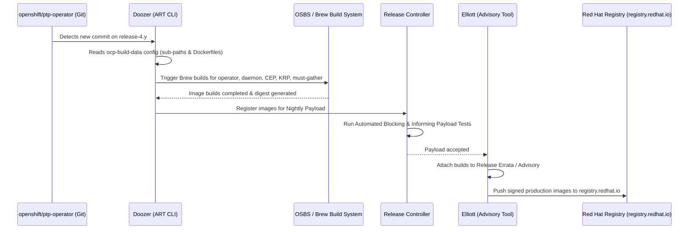
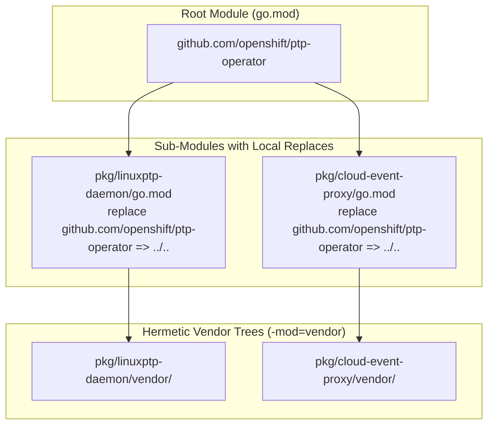
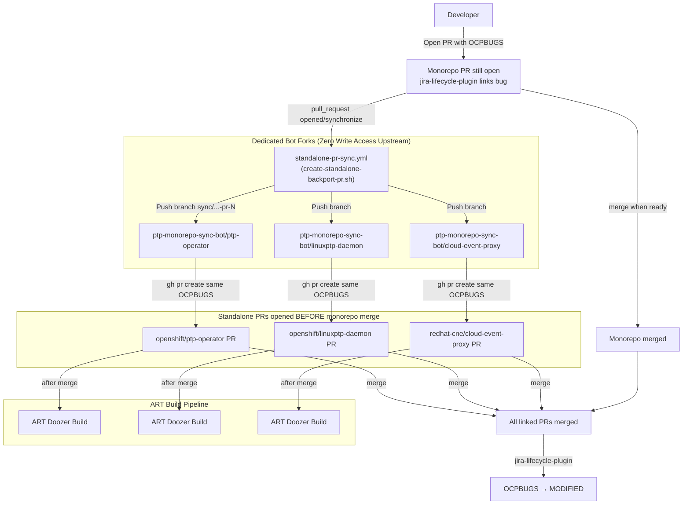

# OpenShift ART Operations Guide

## 1. Overview

**Automated Release Tooling (ART)** is Red Hat's official build and release engine for OpenShift Container Platform (OCP). ART orchestrates container builds, OSBS/Brew RPM and container compilations, release payload assemblies (nightlies and official releases), and errata publishing via **Doozer** and **Elliott**.

This guide covers operational workflows for managing the PTP Operator monorepo with ART.

---

## 2. Day-to-Day Engineering Operations

### 2.1 Branching Strategy & Lifecycle

The downstream monorepo (`openshift/ptp-operator`) maintains:
- **`main`**: Development branch targeting the future major/minor OpenShift release.
- **`release-4.y` / `release-5.x`**: Active OpenShift release branches (`release-4.12` through `release-4.23`, `release-5.0`, `release-5.1`, `release-5.2`).



All bug fixes and features target `main` first and are backported to applicable `release-*` branches via cherry-picks or automated bot PRs.

### 2.2 Working in the Monorepo

Developers modify components in their corresponding directory paths:

```text
openshift/ptp-operator (downstream)
├── Dockerfile.ocp                          # Operator container definition
├── must-gather/Dockerfile.ocp              # Must-gather container definition
├── pkg/
│   ├── linuxptp-daemon/                    # Linuxptp daemon code & Makefile
│   │   └── addons/redhat/Dockerfile.ocp    # Daemon OCP container definition
│   └── cloud-event-proxy/                  # Cloud-event proxy code
│       └── Dockerfile                      # Cloud-event proxy container definition
```

### 2.3 Local Building and Testing



1. **Running Unit Tests:**
   ```bash
   # Operator unit tests
   go test ./...

   # Linuxptp-daemon unit tests
   cd pkg/linuxptp-daemon && go test ./...

   # Cloud-event-proxy unit tests
   cd pkg/cloud-event-proxy && go test ./...
   ```

2. **Testing Container Builds Locally:**
   ```bash
   # Build Operator Image
   podman build -f Dockerfile.ocp -t ptp-operator:local .

   # Build Linuxptp-Daemon Image (context is pkg/linuxptp-daemon)
   podman build -f pkg/linuxptp-daemon/addons/redhat/Dockerfile.ocp \
     -t linuxptp-daemon:local pkg/linuxptp-daemon

   # Build Cloud-Event-Proxy Image (context is pkg/cloud-event-proxy)
   podman build -f pkg/cloud-event-proxy/Dockerfile \
     -t cloud-event-proxy:local pkg/cloud-event-proxy

   # Build Must-Gather Image
   podman build -f must-gather/Dockerfile.ocp -t ptp-must-gather:local .
   ```

---

## 3. ART Image Configuration (`ocp-build-data`)

ART defines all OpenShift images in the [`openshift-eng/ocp-build-data`](https://github.com/openshift-eng/ocp-build-data) repository.

When migrating to or managing the monorepo, image configuration files are updated to point to the unified repository while specifying the exact Dockerfile path and build context:



### 3.1 Example `ocp-build-data` Image Definitions

#### `images/ptp-operator.yml`
```yaml
name: ptp-operator
content:
  source:
    git:
      url: git@github.com:openshift/ptp-operator.git
      branch:
        target: release-{MAJOR}.{MINOR}
    dockerfile: Dockerfile.ocp
    path: .
```

#### `images/ptp-linuxptp-daemon.yml`
```yaml
name: ptp-linuxptp-daemon
content:
  source:
    git:
      url: git@github.com:openshift/ptp-operator.git
      branch:
        target: release-{MAJOR}.{MINOR}
    dockerfile: pkg/linuxptp-daemon/addons/redhat/Dockerfile.ocp
    path: pkg/linuxptp-daemon
```

#### `images/ptp-cloud-event-proxy.yml`
```yaml
name: ptp-cloud-event-proxy
content:
  source:
    git:
      url: git@github.com:openshift/ptp-operator.git
      branch:
        target: release-{MAJOR}.{MINOR}
    dockerfile: pkg/cloud-event-proxy/Dockerfile
    path: pkg/cloud-event-proxy
```

#### `images/ptp-must-gather.yml`
```yaml
name: ptp-must-gather
content:
  source:
    git:
      url: git@github.com:openshift/ptp-operator.git
      branch:
        target: release-{MAJOR}.{MINOR}
    dockerfile: must-gather/Dockerfile.ocp
    path: .
```

---

## 4. Staging Releases and Branch Management

### 4.1 Creating a New Release Branch

When a new OpenShift version branches (e.g. `release-4.24`):
1. Create and push the new branch `release-4.24` in `openshift/ptp-operator`.
2. Add the branch entry to `DOWNSTREAM_RELEASE_BRANCHES` in `scripts/lib/monorepo-build.sh`.
3. If regenerating the monorepo from upstream/downstream components without Konflux:
   ```bash
   make regen-downstream YES=1 NO_KONFLUX=1
   ```

### 4.2 Updating Monorepo Sources for an Existing Release Branch

To refresh components from standalone sources or synchronize changes without full regeneration:
```bash
# Refresh release-4.22 across all components and open a PR
make update-sources YES=1 UPDATE_BRANCH=release-4.22 DOWNSTREAM_ONLY=1
```

---

## 5. Releases & Payload Integration



### 5.1 Nightly Builds and OSBS/Brew Builds
1. **Doozer Triggers:** Doozer polls `openshift/ptp-operator` on each active branch.
2. **Dist-Git Synchronization:** Doozer generates dist-git commits containing the source archive and Dockerfile.
3. **Brew/OSBS Compilation:** OSBS builds the container images in the internal Red Hat build system using the specified builder streams (`openshift-golang-builder`) and base images (`base-rhel9`).
4. **Release Controller Aggregation:** The Release Controller pulls the newly built images and aggregates them into the OpenShift release payload (e.g., `4.18.0-0.nightly-...`).

### 5.2 Errata & Advisory Promotion (Elliott)
- Elliott attaches completed Brew builds to release advisories.
- Quality Engineering (QE) executes payload gating tests.
- Once green, advisories are signed and pushed to `registry.redhat.io`.

---

## 6. Dependency & Pin Management



### 6.1 Builder and Base Images
ART Dockerfiles rely on standard OpenShift CI and OSBS stream tags:
- **Builder Stage:**
  ```dockerfile
  FROM registry.ci.openshift.org/ocp/builder:rhel-9-golang-1.22-openshift-4.18 AS builder
  ```
  *(Doozer dynamically swaps `registry.ci.openshift.org` builder references during OSBS builds to internal Brew builder images).*
- **Runtime Stage:**
  ```dockerfile
  FROM registry.ci.openshift.org/ocp/4.18:base-rhel9
  ```

### 6.2 Go Module Vendoring & Local Replaces
The monorepo contains multiple Go modules:
- Root: `github.com/openshift/ptp-operator`
- `pkg/linuxptp-daemon`: `github.com/openshift/linuxptp-daemon`
- `pkg/cloud-event-proxy`: `github.com/redhat-cne/cloud-event-proxy`

*(Note: `kube-rbac-proxy` is consumed directly from the OpenShift payload image `registry.redhat.io/openshift4/ose-kube-rbac-proxy-rhel9` and is not maintained or built in `pkg/`).*

To build hermetically within OSBS and comply with ART policies:
1. Sub-modules declare local replace directives pointing to root if needed.
2. Each sub-module maintains its own `vendor/` directory (`go mod vendor`).
3. `GOFLAGS="-mod=vendor"` is enforced during builds.

```bash
# To update and verify vendor directories across all sub-modules:
cd pkg/linuxptp-daemon && go mod tidy && go mod vendor
cd ../cloud-event-proxy && go mod tidy && go mod vendor
```

---

## 7. Outbound Monorepo-to-Standalone PR Bridge (Legacy ART Releases)

### 7.1 Context & Motivation

During the transition period, OpenShift ART (`openshift-eng/ocp-build-data`) builds `main` and legacy release branches (`release-4.12` through `release-4.23`) by pulling from separate standalone repositories:
- `ptp-operator` -> `https://github.com/openshift/ptp-operator`
- `ptp-linuxptp-daemon` -> `https://github.com/openshift/linuxptp-daemon`
- `ptp-cloud-event-proxy` -> `https://github.com/redhat-cne/cloud-event-proxy`

To avoid dual-maintenance while ensuring all development and backports happen exclusively in `redhat-cne/downstream-ptp-operator-monorepo`, an **Automated Outbound PR Bridge** mirrors merged commits on `main` and active release branches to the respective standalone repositories via Pull Requests.



### 7.2 Zero-Upstream-Write Fork Security Model

The bridge uses a **Fork Model** to eliminate the need for write or push access to the upstream `openshift/*` repositories:
1. The sync bot pushes topic branches (`sync/monorepo-<BRANCH>-<SHORT_SHA>`) exclusively to its own forks (e.g., `https://github.com/ptp-monorepo-sync-bot/*`).
2. The bot opens a cross-repository Pull Request from the fork against the target upstream base branch.
3. Every generated PR contains:
   - OpenShift/Jira-compliant title (no `[Monorepo Sync]` prefix):
     - `main`: `OCPBUGS-N: <subject>`
     - `release-X.Y`: `[release-X.Y] OCPBUGS-N: <subject>`
   - Provenance via label `monorepo-sync`, PR body links, and git trailer `Monorepo-Commit: <FULL_SHA>` (not a title prefix).
   - The **same Jira key(s)** from the monorepo commit/PR on every component PR for that branch.
   - Automated PR comment linking back to the monorepo commit.
   - Does **not** apply `cherry-pick-approved` / `backport-risk-assessed` (humans / QE).

### 7.3 OpenShift Bot / Jira Conventions

The downstream monorepo has the same OpenShift Prow stack as standalone repos, including **`jira-lifecycle-plugin`** and cherrypick. That plugin links every GitHub PR whose title references an `OCPBUGS` key and moves the bug to **MODIFIED only after all linked PRs have merged**.

Therefore the outbound bridge **must open standalone PRs while the monorepo PR is still open** (CI `pull_request` on opened/synchronize/ready_for_review), **not** on push-after-merge. Otherwise the monorepo merge alone can flip the bug to MODIFIED before openshift/* / cep PRs exist.

Day-one policy while ART still builds from standalone repos:

| Concern | Policy |
|---|---|
| CI trigger | `pull_request` (open/sync) on monorepo — not `push` after merge |
| Where to develop / backport | Only in `downstream-ptp-operator-monorepo`. Do not `/cherry-pick` on standalone. |
| Jira on `main` fix | One `OCPBUGS` on the monorepo PR; bridge reuses it on all outbound standalone PRs (ptpop / lptpd / cep) **before** merge. |
| Jira on each backport | One **clone** per target release (via `/jira backport` on the **monorepo**). That clone key is reused on all standalone PRs for that `release-X.Y`. |
| MODIFIED transition | After monorepo PR **and** all linked standalone PRs merge |
| Title prefix | Never `[Monorepo Sync]`. Use OpenShift cherrypick-robot title shape. |
| Provenance | Label `monorepo-sync` + body + `Monorepo-Commit` trailer. Topic branch `sync/monorepo-<branch>-pr-<N>`. |
| Merge labels on `release-*` | Humans/QE still apply `cherry-pick-approved` and `backport-risk-assessed`. |
| OpenShift org cherrypick plugin | Remains enabled org-wide (cannot disable per-repo). Ignore / close accidental standalone cherry-pick PRs. |

Override detection with `--jira OCPBUGS-123` when the monorepo PR title lacks a key.

If `monorepo-sync` cannot be created on `openshift/*` (curated label allowlist), open a PR against `openshift/release` to allowlist it; provenance still remains in the body and trailer.

### 7.4 Manual / Local CLI Execution

Developers can run the bridge script locally using their own GitHub credentials or personal forks:

```bash
# Dry-run to inspect generated patches and PR content
./scripts/create-standalone-backport-pr.sh --branch release-4.22 --commit HEAD --dry-run

# Force Jira key reused on every component PR
./scripts/create-standalone-backport-pr.sh --branch release-4.22 --commit HEAD --jira OCPBUGS-12345

# Run for a specific component
./scripts/create-standalone-backport-pr.sh --branch release-4.22 --commit HEAD --components lptpd --fork-owner <github_user>

# Run for a range of commits
./scripts/create-standalone-backport-pr.sh --branch release-4.21 --range origin/release-4.21..HEAD
```

### 7.5 Bot Account & Fork Setup

1. **GitHub Organization / Bot Namespace:**
   - Create a free GitHub Organization (e.g. `ptp-monorepo-sync-bot`) or designate a bot account.
2. **Fork the Standalone Repositories:**
   ```bash
   gh repo fork openshift/ptp-operator --org ptp-monorepo-sync-bot --clone=false
   gh repo fork openshift/linuxptp-daemon --org ptp-monorepo-sync-bot --clone=false
   gh repo fork redhat-cne/cloud-event-proxy --org ptp-monorepo-sync-bot --clone=false
   ```
3. **GitHub App Credentials (Configured in Monorepo Secrets):**
   - `SYNC_APP_ID`: GitHub App ID
   - `SYNC_APP_PRIVATE_KEY`: GitHub App RSA Private Key PEM
   - `SYNC_BOT_FORK_OWNER`: `ptp-monorepo-sync-bot`
   - `SYNC_BOT_TOKEN`: classic `public_repo` PAT for `gh pr create` into upstream bases

### 7.6 Release Sunsetting

As ART migrates image build definitions to point directly to the downstream monorepo for a given release (e.g. `release-5.0` or future releases), remove that release branch from the trigger list in `.github/workflows/standalone-pr-sync.yml`.

