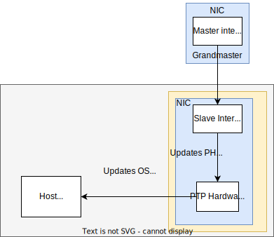
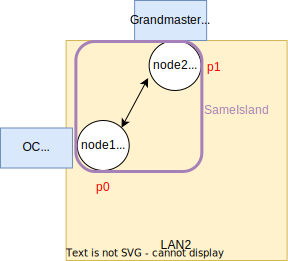
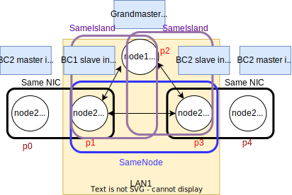
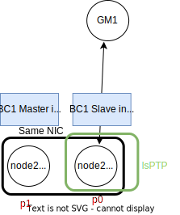
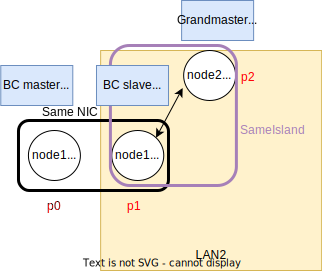
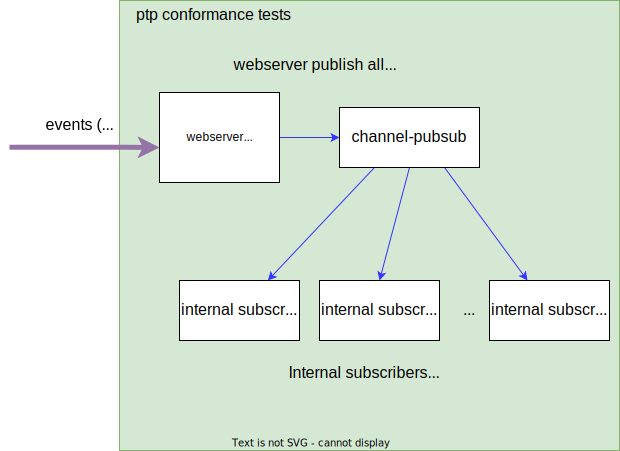

# Developer documentation

## OC, BC and Dual NIC BC configuration Models
The following ptp clocks type are used in this documentation: Ordinary Clock (OC), Boundary Clock (BC) and Dual Nic Boundary Clock (Dual NIC BC). PTP clocks are useful for hosts that needs to synchronize their hardware clock very accurately to around few nanoseconds.

### Ordinary Clock
The simplest ptp clock configuration is the Ordinary clock. In this case, the clock just needs to received synchronization info from a source of synchronization or master. It is very similar in functionality to the less accurate but ubiquitous Network Time Protocol (NTP), just setting the Host internal clock to track a very accurate master clock. The root source of synchronization is the Grand master. It is determined by the Best Master Clock Algorithm. 

For the purpose of this test suite, we consider that clock configuration is static, so the Grandmaster will not move because of the very constrained scenario. Cases that consider Best Master Clock algorithm could be created in the future.

`ptp4l` is the executable responsible for the ptp clock synchronization. ptp4l role is to synchronize the NIC's PTP hardware clock (PHC) with the remote master clock. 

`phc2sys` is another executable responsible for synchronizing the PHC clock to the host's OS clock 



### Boundary Clock
Boundary clocks (BC) also synchronize to a master clock , just like an ordinary clock. In addition, BC clocks are also a master to downstream ordinary or boundary clocks. This allow propagating synchronization information to many hosts. Network switches are great location to implement boundary clock since they connect to many hosts. However, a regular server equipped with a 2-ports network card supporting PTP will also be able to implement PTP BC clocks.


### Dual NIC Boundary Clock
Dual NIC BC are similar to boundary clocks except that their provide more master ports to synchronize more ordinary/boundary clocks. Network cards are usually limited to a maximum of 4 ports sharing a PTP Hardware clock. If more than 4 downstream clocks need to received synchronization 2 NIC can be configured together using the Dual NIC BC pattern. 

A primary Boundary clock receives synchronization from a master clock and a secondary boundary clock also receives updates from a Master clock which synchronizes its PHC. However, the secondary BC does not run phc2sys to synchronize its PHC with the OS clock. Note: this is not a high availability configuration. If the Primary connection to the Grandmaster is lost, the secondary BC will not take over its role. The interfaces served by the primary card will just loose lock.


## Project organization
```
.
├── conformance
│   ├── config
│   │   ├── ptptestconfig.go : functions responsible for creating or storing the ptp yaml user configuration
│   │   ├── ptptestconfig_test.go : test file for yaml user configuration functions
│   │   ├── ptptestconfig.yaml: user test configuration file, used to pass parameters to the test suite
│   │   └── testdata
│   │       ├── cfg1.yaml: test configuration used in unit testing
│   │       └── cfg2.yaml: test configuration used in unit testing
│   ├── parallel: parallel test cases(can make use of gomega/ginkgo)
│   │   ├── parallel_suite_test.go: go main for parallel suite 
│   │   └── ptp.go: parallel test cases 
│   ├── serial: serial test cases(can make use of gomega/ginkgo)
│       ├── prometheus.go: function related to supporting testcases using Prometheus metrics
│       ├── ptp.go: serial test cases 
│       ├── serial_suite_test.go: go main for serial suite 
├── DEVELOPERS.md: this file
├── doc: directory storing documentation artifacts
│   ├── bc_configuration_flowchart.svg
│   ├── l2topology.svg
│   ├── multi_bc.svg
│   ├── multi_bc_with_slave.svg
│   ├── multi_dnbc.svg
│   ├── multi_dnbc_with_slaves.svg
│   ├── multi_oc.svg
│   ├── ptptestconfig.svg
│   ├── sno_bc.svg
│   ├── sno_dnbc.svg
│   └── sno_oc.svg
├── pkg: directory storing ptp testing support functions (avoid using ginkgo / gomega, except in ptptesthelper.go)
│   ├── clean
│   │   └── clean.go: functions used to clean the namespace after the test is done to remove any temporary objects
│   ├── client
│   │   └── clients.go: functions used to access the k8s golang API (goclient)
│   ├── consts.go: constants used by ptp tests
│   ├── event
│   │   └── event.go: functions used to manipulate events
│   ├── execute
│   │   └── ginkgo.go: functions used to customize Ginkgo execution
│   ├── images
│   │   └── images.go: functions to get pod's image
│   ├── logging
│   │   └── logging.go: logging related functions (set log level)
│   ├── metrics
│   │   ├── prometheus.go: support function to run prometheus queries
│   │   └── metrics.go: support functions for prometheus metrics
│   ├── namespaces
│   │   └── namespaces.go: support functions to handle k8s namespaces
│   ├── nodes
│   │   └── nodes.go: support functions to handle k8s nodes
│   ├── pods
│   │   └── pods.go: support functions to handle k8s pods
│   ├── ptphelper
│   │   └── ptphelper.go: helper function to check ptp functionality
│   ├── ptptesthelper
│   │   └── ptptesthelper.go: test helper functions using ginkgo/gomega
│   └── testconfig
│       ├── testconfig.go: internal test configuration database. It is holding global information about PTP clocks, interfaces, etc for the cluster
│       └── testconfig_test.go: unit test for internal configuration database
├── README.md: user level documentation
├── scripts
│   └── ptp-cpu-usage.sh: test script to record CPU usage of PTP containers
└── validation
    ├── tests
    │   └── validation.go: basic ptp-operator validation tests
    └── test_suite_test.go: main go file for ptp validation test
```
 
## Current test description
### Validation tests
#### should have the ptp namespace
Checks that the "openshift-ptp" namespace is created in the configured cluster. Fails if "openshift-ptp" is not found
#### should have the ptp operator deployment in running state
Checks that the "ptp-operator" deployment is deployed and ready. Expected replica are matching available replicas. Fails if the deployment fails to be ready after a 10 minute timeout.
#### should have the linuxptp daemonset in running state
Checks that the "linuxptp-daemon" daemonset is in running state meaning that expected replicas match available replicas and all pods are in a ready state. Fails if the "linuxptp-daemon" fails to become ready after 5 minutes.
#### should have the ptp CRDs available in the cluster
Check that all 3 CRDs created by the ptp-operator are created in the cluster: 
- "nodeptpdevices.ptp.openshift.io"
- "ptpconfigs.ptp.openshift.io"
- "ptpoperatorconfigs.ptp.openshift.io"
Fails if one or more CRD is missing.
### Serial test: 
#### Should check whether PTP operator needs to enable PTP events
Check whether ptp-events are enabled by checking the "default" ptpoperatorconfigs CR. If "EnableEventPublisher" ("ptpConfig.Spec.EventConfig.EnableEventPublisher") is set to false this test case fails. Example ptpoperatorconfigs below:

```
$ oc edit ptpoperatorconfigs.ptp.openshift.io default -n openshift-ptp

apiVersion: v1
items:
- apiVersion: ptp.openshift.io/v1
  kind: PtpOperatorConfig
  metadata:
    creationTimestamp: "2019-10-28T06:53:09Z"
    generation: 4
    name: default
    namespace: openshift-ptp
    resourceVersion: "2364095"
    selfLink: /apis/ptp.openshift.io/v1/namespaces/openshift-ptp/ptpoperatorconfigs/default
    uid: d7286542-34bd-4c79-8533-d01e2b25953e
  spec:
    ptpEventConfig:
      enableEventPublisher: true
      transportHost: "http://ptp-event-publisher-service.openshift-ptp.svc.cluster.local:9043"
      # For AMQP transport, transportHost: "amqp://amq-router.amq-router.svc.cluster.local"
    daemonNodeSelector:
      node-role.kubernetes.io/worker: ""
kind: List
metadata:
  resourceVersion: ""
  selfLink: ""
  ```
#### Should check whether PTP operator appropriate resource exists
checks that the "ptpoperatorconfigs" resource exists when listing all api-resources (oc api-resources). Fails if "ptpoperatorconfigs" is not present.
#### Should check that all nodes are running at least one replica of linuxptp-daemon
Checks that the number of scheduled linuxptp-daemon pods match the number of nodes in the cluster. Fails if the number of linuxptp-daemon pods does not match the number of nodes in the cluster
#### Should check that operator is deployed
Checks that the ptp-operator deployment is available, fails otherwise.
#### The slave node network interface is taken down and up
Check network outage scenario for the interface supporting the ptp slave clock ports. For each interface used by the clock under test that is not a management port turn it down then up. The ptp clock under test should recover after a preset amount of time of 1 minute. If for any interface outage the clock fails to recover in 1 minute, this test fails. 
#### The slave node is rebooted and discovered and in sync
Check cluster reboot scenario. The node implementing the clock under test is rebooted. This test should verify that the linuxptp-daemon pod is properly coming back up. Next, this test should verify that the clock under test is synchronized to a Grand master after a preset amount of time of 10 minutes.
#### The interfaces supporting ptp can be discovered correctly
Checks that the ptp interface discovered by the ptp API ( node ptp device ) for a node is correct. Valid interfaces for use in PTP should support the following requirements:
- the interface is not virtual (e.g. VLAN)
- PTP HW capabilities are present
    - HwRx
    - HwTx 
    - HwRawClock
For each node compile a list of interfaces satisfying the above requirements and compare it to the list retrievd via the node ptp device API. Example API output:
```
[deliedit@redhatwork test]$ oc get nodeptpdevices.ptp.openshift.io  -nopenshift-ptp master-2.clus0.t5g.lab.eng.rdu2.redhat.com -oyaml 
apiVersion: ptp.openshift.io/v1
kind: NodePtpDevice
metadata:
  creationTimestamp: "2023-02-10T16:53:30Z"
  generation: 1
  managedFields:
  - apiVersion: ptp.openshift.io/v1
    fieldsType: FieldsV1
    fieldsV1:
      f:spec: {}
    manager: ptp-operator
    operation: Update
    time: "2023-02-10T16:53:30Z"
  - apiVersion: ptp.openshift.io/v1
    fieldsType: FieldsV1
    fieldsV1:
      f:status:
        .: {}
        f:devices: {}
    manager: ptp
    operation: Update
    subresource: status
    time: "2023-02-10T16:53:38Z"
  name: master-2.clus0.t5g.lab.eng.rdu2.redhat.com
  namespace: openshift-ptp
  resourceVersion: "127631272"
  uid: 3a46b612-7bb8-42ad-9f45-2c7d2c3b1e77
spec: {}
status:
  devices:
  - name: ens1f0
  - name: ens1f1
  - name: ens2f0
  - name: ens2f1
  - name: ens3f0
  - name: ens3f1
[deliedit@redhatwork test]$ 
```
#### Should retrieve the details of hardwares for the Ptp
Dumps the detailed cluster network interfaces PCI information, including:
- PCI device ID
- PCI function 
- PCI  description string
Also dumps the Slave Clock under test information and if available (multinode scenario) the Grandmaster detailed clock configuration. This test always succeeds except in case of internal errors.
#### PTP daemon apply match rule based on nodeLabel
Checks that the label indicated in the ptpconfig for the clock under test and the grandmaster clock (multinode scenario) matches the node where the corresponding ptp profiles are loaded. The loaded ptp profiles are detected in the logs including the line `Profile Name: <profile name>`. This test fails if the profile name in the linuxptp-daemon log does not match the profile configured in the ptpconfig for this node (node is indicated by a target label) 
#### Slave can sync to master
Checks that the clock under test can sync of a Grandmaster by looking at logs and metrics information. For a given clock under test the following steps imply that the clock is in sync with the right master:
- configure a single Grandmaster directly connected to a slave clock under test
- retrieve the Grandmaster clock ID
- identify the clock under test pod/node based on ptpconfig target label
- in the clock under test logs, verify that the Grandmaster clock ID is detected by the clock under test and is the best master clock. The Grand master ID should appear in the log identified by the string: "new foreign master". If not, fail the test. In discovery mode, it is ok to skip this test since the logs might no longer be available
- From within the pod under test get the following metrics ( endpoint at `127.0.0.1:9091/metrics` ): 
    - openshift_ptp_interface_role: verify that the clock under test has a slave role
    - openshift_ptp_clock_state: clock state should be LOCKED
    - openshift_ptp_offset_ns: the clock offset should be within a good range (-100 ns and +100 ns, configurable)
The test fails if the metrics are not reporting the expected values after a timeout or if any of the previous steps fail.
#### Downstream slave can sync to BC master
Check that the slave ordinary clocks configured to sync of BC clock can actually sync.  The steps described in the "Slave can sync to master" test case are repeated in this test case for each clock synching of a BC or dual nic BC clock. If the test clocks achieve synchronization from the BC clock under test, 
#### Can provide a profile with higher priority
Checks that creating a profile with a higher priority will become active and reach clock locked state. Also verifies that 
deleting the higher priority profile will re-activate the lower priority one. This test fails if any of the previous steps fail. Priority is configured in the ptp-config as below (lower numbers mean higher priority): 
```
apiVersion: ptp.openshift.io/v1
kind: PtpConfig
metadata:
  name: boundary-clock-ptpconfig
  namespace: ptp
spec:
  profile:
  - name: "profile1"
    ptp4lOpts: "-s -2"
    phc2sysOpts: "-a -r"
    ptp4lConf: |
      [ens7f0]
      masterOnly 0
      [ens7f1]
      masterOnly 1
      [ens7f2]
      masterOnly 1
  recommend:
  - profile: "profile1"
    priority: 0
    match:
    - nodeLabel: "ptp/clock-under-test"
```
#### Should check for ptp events
checks that ptp events are operating properly by testing the following:
- the "cloud-event-proxy" container sidecar is present
- the metrics url (`127.0.0.1:9091/metrics`) inside the linuxptp-daemon is present and responding to queries. check for the presence of the following metrics: openshift_ptp_interface_role and openshift_ptp_threshold
- the events api is responding to a health query with "OK" in cloud-events-proxy container at the following url: `127.0.0.1:9085/api/ocloudNotifications/v1/health`. 
- the events api is responding to a publisher query with a non empty result containing "endpointUri" in the cloud-event-proxy container at the following url: `127.0.0.1:9085/api/ocloudNotifications/v1/publishers`
- checks for the following strings in the cloud-events-proxy container to verify that events are sent by the publisher: "Created publisher" and "event sent"
The test fails if any of these steps fail
#### Should check whether using fifo scheduling
Checks that the ptp scheduling policy is configured to FIFO (realtime process) and that at least one linuxptp-daemon pod is deployed. 
Checks for the output of the chrt function configuring the realtime priority in the linuxptp-daemon logs. The following output should appear for each profile configured by the linuxptp-daemon: 
`/bin/chrt -f <priority> /usr/sbin/ptp4l`  where `<priority>` is the priority configured for a given profile

example ptpconfig showing a SCHED_OTHER scheduling policy:
```
oc get ptpconfig -nopenshift-ptp test-slave1 -oyaml 
apiVersion: ptp.openshift.io/v1
kind: PtpConfig
metadata:
  creationTimestamp: "2023-03-03T16:19:37Z"
  generation: 1
  managedFields:
  - apiVersion: ptp.openshift.io/v1
    fieldsType: FieldsV1
    fieldsV1:
      f:spec:
        .: {}
        f:profile: {}
        f:recommend: {}
    manager: parallel.test
    operation: Update
    time: "2023-03-03T16:19:37Z"
  name: test-slave1
  namespace: openshift-ptp
  resourceVersion: "148997057"
  uid: 1cc39828-d2da-432a-94f3-7d57149971ca
spec:
  profile:
  - interface: ens3f1
    name: test-slave1
    phc2sysOpts: -a -r -n 24 -m -N 8 -R 16
    ptp4lConf: |-
      [global]
      tx_timestamp_timeout 50
      ptp_dst_mac 01:1B:19:00:00:00
      p2p_dst_mac 01:80:C2:00:00:0E
      domainNumber 24
      logging_level 7
    ptp4lOpts: -2 -s --summary_interval -4
    ptpClockThreshold:
      holdOverTimeout: 5
      maxOffsetThreshold: 100
      minOffsetThreshold: -100
    ptpSchedulingPolicy: SCHED_OTHER
    ptpSchedulingPriority: 65
  recommend:
  - match:
    - nodeLabel: ptp/clock-under-test
    priority: 5
    profile: test-slave1
```

#### Should not be able to use the uds
Checks that an unprivileged pod cannot run the pmc command with the uds socket:
- create an unprivileged pod 
- run `pmc -u -f /var/run/ptp4l.0.config "GET CURRENT_DATA_SET`
- the command shoud return `Permission denied`
This test fails if the pmc command is able to access the uds socket when running in a unprivileged container

#### Should be able to sync using a uds
Checks that the linuxptp-daemon pod can run the pmc command with the uds socket:
- run `pmc -u -f /var/run/ptp4l.0.config "GET CURRENT_DATA_SET` in the linuxptp-daemon pod 
- the command should not return `Permission denied` or `failed to open configuration file`, 
- create an privileged pod 
- run `pmc -u -f /var/run/ptp4l.0.config "GET CURRENT_DATA_SET`
- the command should not return `Permission denied` or `failed to open configuration file`,
- finally, the following command `ls -1 -q -A /host/secrets/` should return an empty string
This test fails if the pmc command is not able to access the uds socket even when running in a privileged container

#### Should all be reported by prometheus
Checks that metrics reported using the metrics api in the linuxptp-daemon pod are the same as the one reported by prometheus
- get all ptp metrics in linuxptp-daemon using `curl localhost:9091/metrics`. The ptp metrics are prefixed with "openshift_ptp_", for instance "openshift_ptp_interface_role"
- get all prometheus metrics using:
    - get the prometheus pod using the LabelSelector: `app.kubernetes.io/name=prometheus`
    - run a promql query in the prometheus pod to get all the metrics `curl -s http://localhost:9090/api/v1/query --data-urlencode 'query=<ptp-metric>'`, where `<ptp-metric>` is a metric retrieved in the previous step with the metrics API, for instance "openshift_ptp_interface_role"
### Soak tests
#### PTP CPU Utilization
Checks that the cpu usage of all the ptp resources remains under configured (millicores) thresholds. For the duration of the soak test, every minute the cpu usage of each ptp pod/container will be retrieved and compared against its corresponding threshold, in case its configured. For that check cycle, if any of the configured thresholds is surpassed, the failure counter is increased. The test case runs for the configured duration minutes or until the failure counter reaches the configured limit.

The cpu usage of each pod/container is retrieved using the prometheus metric "container_cpu_usage_seconds_total", using the `rate` function for the configured time-window. The `rate` function uses the last and the first samples in that period, substracts them, and divides the result by the time difference between them.  
To get this prometheus metric per pod/container, the test case first gets the first of the prometheus statefulset's pods int he cluster:
```
$ get pods -n openshift-monitoring
...
prometheus-k8s-0                               6/6     Running   12         25d
prometheus-k8s-1                               6/6     Running   21         106d
...
```
Once the prometheus pod is found, the test cases uses it to run "curl" commands inside, similar to this one:
```
oc exec -n openshift-monitoring prometheus-k8s-0 -- curl -s http://localhost:9090/api/v1/query --data-urlencode 'query=rate(container_cpu_usage_seconds_total{container="", pod="linuxptp-daemon-gdzhf", namespace="openshift-ptp"}[60s])'
```
The previous command would get the rate for the cpu usage secs for the pod "linuxptp-daemon-gdzhf" for the last 60 seconds.

This is the test case procedure:
1. Gets all the ptp pods per node found in the cluster.
2. For each node, iterates over its deployed ptp pods to:
	1. Get the total ptp pod usage.
	2. Checks the config and compares the ptp pod usage against the configured cpu threshold for that pod type.
	3. Accumulates that pod's cpu usage to the total node's one.
	4. For each container of that ptp pod:
		1. Gets its cpu usage.
		2. Checks the config and compares the container usage against the configured cpu threshold for that pod type and container name.

Some helper functions were created for this test case:
  - `RunPrometheusQueryWithRetries`: Runs a prometheus query and retries it in case the "curl" command fails or the result is not the expected. The function accepts a callback function that will be called with the response obtained. If the function is not nil and it returns false, there will be a new attempt. For this test case, the query has the template `rate(container_cpu_usage_seconds_total{namespace="%s", container="%s", pod="%s"}[%s])`
  - `GetContainerCpuUsage`: Gets the cpu usage of a ptp container. Calls "RunPrometheusQueryWithRetries" with the corresponding pod and container names and the ptp namespace "openshift-ptp".
  - `GetPodTotalCpuUsage`: Gets the total cpu usage of a ptp pod. Calls "RunPrometheusQueryWithRetries" with the corresponding pod name and the ptp namespace "openshift-ptp". The container name is set to empty string "".
  - `GetCadvisorScrapeInterval`: As the `rate` function needs at least two samples to work, this function is used to get the current scrape interval that is used to scrape the kubelet's cadvisor, which is the module that exposes the cpu usage metric we're looking for. The test case won't run if the configured time-window is lower than twice the cadvisor scrape interval. The scrape interval is configured in the prometheus ServiceMonitor resource, so the prometheus go-client is used to get this value:
	```
	$ oc get servicemonitors.monitoring.coreos.com -n openshift-monitoring kubelet
	NAME      AGE
	kubelet   234d
	```

As the ptp configuration is created at the beginning of the test suite, it is not possible to know in advance the full name of the ptp daemonset/operator pods names. This implies that it is not possible to configure a threshold for this individual pods. Instead, a per "pod type" (ptp-operator/linuxptp-daemon) configuration was created. See the [README.md](README.md) for more information on how to setup cpu usage thresholds for these two pod types.

#### PTP Slave Clock Sync
Checks that the OS clock stays within configured min/max offset values (configurable) for the duration of the soak test
Steps:
- configure ptp events in ptp-operator
- configure min/max offset values in the ptpconfig using the ptpClockThreshold object:
```
    ptpClockThreshold:
      holdOverTimeout: 5
      maxOffsetThreshold: 100
      minOffsetThreshold: -100
```
- instantiate a consumer sidecar and configure it to connect to the right ptp event service: `ptp-event-publisher-service-<nodename>.<publisher_namespace>.svc.cluster.local:9043`. where `<nodename>` is the nodename where the clock under test is configured and `<publisher_namespace>` is the openshift-ptp namespace
Example side car configuration:
```
Args: []string{"--metrics-addr=127.0.0.1:9091",
						"--store-path=/store",
						"--transport-host=consumer-events-subscription-service.<sidecar_namespace>.svc.cluster.local:9043",
						"--http-event-publishers=ptp-event-publisher-service-<nodename>.<publisher_namespace>.svc.cluster.local:9043",
						"--api-port=8089"},
```
- use the ptp-events-api or some other mean to register the OsClockSyncStateChange event 
- retrieve the initial state of the OsClockSyncStateChange resource monitored by the event. This is because the events
only indicate changes to the state of the resource
- listen for events for the duration of the test. 
  - in a first phase, wait for the clock to be in LOCKED state as indicated by the OsClockSyncStateChange events. Until this happens, the test cannot start. if the clock is never LOCKED, fail the test
  - in a second phase, start monitoring and recording the state of the os clock. every time the clock is not LOCKED record a failure. Fail the test if the number of failure exceeds a threshold (configurable). Dump the recorded state transitions corresponding to events in a CSV file
  - if the test transition to a state other than "LOCKED" less than the threshold, then the test will last its configured duration and succeed. Dump the recorded state transitions corresponding to events in a CSV file.

## General conformance testcase Workflow 
The Test mode discovery workflow is as follows:

 

 ### Environment variable to select the test case scenario (Discovery, OC, BC, Dual NIC BC)

 The PTP_TEST_MODE environment variable indicates which type of clock the user would like to test. There are 4 modes possible:
 - discovery: in this mode, the ptp configuration already present in the node is kept and is the one used for testing
 - OC, BC, or DualNicBC: in these modes, the tool will need to create a valid configuration first
- if PTP_TEST_MODE is unset, it is the same as PTP_TEST_MODE=OC, for backward compatibility
 The `GetDesiredConfig` function retrieves the PTP_TEST_MODE environment variable and returns the first TestConfig object that will be the base for the global configuration used by the tests. PtpModeDesired and Status are initialized
  
 ### L2 discovery 
 To test ptp configurations withing a single cluster, conditions needs to be satisfied for each scenarios. For instance in the simple Ordinary clock scenario, we just need a cluster with 2 nodes which are connected with at least one L2 LAN (it could be the same link use for openshift management). the Grandmaster is created on one node, the ordinary clock on the other. The Grandmaster and OC clock sends ptp messages over the LAN to initiate synchronization. Most cluster could satisfy these constraints. 

 The dual nic BC scenario is at the other end of the spectrum and had a lot more requirement. For starters at least one node in the cluster needs to have 2 NICs each connected to a other node via a LAN for the grandmaster. If testing clock getting synchronization from the BC clocks additional LANs and nodes are needed
 To simplify the configuration process, in a first step, the resources available in the cluster are discovered. These are basically the nodes, NICs, ports supporting ptp adn how they are connected to each other. 
 In a second step, we define each of our scenarios as a problem with a set of constraints that we are trying to solve with the discovered graph.

 The following code gets the cluster L2 configuration, describing how each of the NICS are physically connected and with added metadata such as PCI information:
 ```
 	// Initialize l2 library
	l2lib.GlobalL2DiscoveryConfig.SetL2Client(client.Client, client.Client.Config)

	// Collect L2 info
	config, err := l2lib.GlobalL2DiscoveryConfig.GetL2DiscoveryConfig(true)
	if err != nil {
		return fmt.Errorf("Getting L2 discovery info failed with err=%s", err)
	}
	GlobalConfig.L2Config = config

 ```
 The config is added to the global configuration started with the desired config 
 L2Config is of type L2Info and stores the list of LANs, Nodes, interfaces in the cluster
 ```
 type L2Info interface {
	// list of cluster interfaces indexed with a simple integer (X) for readability in the graph
	GetPtpIfList() []*l2.PtpIf
	// list of unfiltered cluster interfaces indexed with a simple integer (X) for readability in the graph
	GetPtpIfListUnfiltered() map[string]*l2.PtpIf
	// LANs identified in the graph
	GetLANs() *[][]int
	// List of port receiving PTP frames (assuming valid GM signal received)
	GetPortsGettingPTP() []*l2.PtpIf

	SetL2Client(kubernetes.Interface, *rest.Config)
	GetL2DiscoveryConfig(ptpInterfacesOnly bool) (config L2Info, err error)
}
 ```

### Graph solver
With the L2Config data configured in the global configuration, we can find possible ways how to configure ptp to satisfy the OC, BC or dual nic BC scenarios. 
This is achieved with the `initAndSolveProblems` function and uses the https://github.com/test-network-function/graphsolver-lib project
This functions defines the problem as a set of constraints that need to be satisfied for the solution to be valid.
Let's take the example of the OC problem as described in this picture:


This is the corresponding problem definition:
```
	data.problems[AlgoOCString] = &[][][]int{
		{{int(solver.StepNil), 0, 0}},         // step1
		{{int(solver.StepSameLan2), 2, 0, 1}}, // step2
	}
```
This problem has 2 steps. Satisfying each steps adds an interface to the solution. In this case we need to find 2 interfaces in the cluster, interface p0 and p1.
This is the meaning of each lines:
```
{{int(solver.<constraint_function>), <constraint_funtion_parameters_number>, <list of parameters>}},         // step1
```
where `<constraint_function>` is a function validating if a single constraint is satisfied
`<constraint_funtion_parameters_number>` is the number of interfaces parameters of the contraint function. 2 means that the function is taking 2 interfaces parameters.
`<list of parameters>` is the list of interface parameters that the constraint function is using. for instance 0 means p0 and 1 means p1. 
```
{{int(solver.StepNil), 0, 0}},         // step1
```
 The first step is the init and is the same for all problems. The first interface does not need to satisfy any constraints in the first step. 
 ```
 {{int(solver.StepSameLan2), 2, 0, 1}}, // step2
 ```
 The second step reads as follows. Finds a second interface p1 where StepSameLan2(p0, p1) is true, meaning that interface p0 and p1 are in the same LAN. So for the basic OC case we just need 2 ptp interfaces that are connect via a LAN. The solver wil try every combination of solutions satisfying these requirements and return the solutions.
 More complex scenarios are working on the same model. 
 One step can check multiple constraints, for instance in the dual NIC BC without slaves problem below in step 4:
 
 ```
 	data.problems[AlgoDualNicBCString] = &[][][]int{
		{{int(solver.StepNil), 0, 0}},         // step1
		{{int(solver.StepSameNic), 2, 0, 1}},  // step2
		{{int(solver.StepSameLan2), 2, 1, 2}}, // step3
		{
      {int(solver.StepSameNode), 2, 1, 3}, // step4
			{int(solver.StepSameLan2), 2, 2, 3}  // step4
    },
		{{int(solver.StepSameNic), 2, 3, 4}}, // step5
 ``` 
in step 4 we are checking that p1 and p3 are in the same node and that p2 and p3 are in the same LAN. Note that you can only do a constraint check if the interface is already selected from previous steps.
So for instance, in step 4, interfaces p0, p1, p2, p3 are selected (the 4 first ones). So in step 4 we can run constraints on any of these interfaces, but not let's say on p4 since it is not selected yet. 
The number of steps, not including the first one must be equal to the number of interfaces.

Another information needed is the role each of these interfaces p0, p1, p2, ... are playing such as grandmaster
```
const NumTestClockRoles = 7
const (
	Grandmaster TestIfClockRoles = iota
	Slave1
	Slave2
	BC1Master
	BC1Slave
	BC2Master
	BC2Slave
)
```
the roles above corresponds to each of the individual interfaces of clocks under test:
- `Grandmaster` is the Grandmaster master interface
- `slave1` is the slave port of the OC clock or the slave port of the OC slave to BC clock or the OC slave to the first BC clock in dual NIC BC mode
- `slave2` is the slave port of the OC slave to the second BC clock in dual NIC BC mode
- `BC1Master` is the master port of the BC clock or the master port of the first BC clock in the DualNic BC scenario
- `BC2Master` is the master port of the second BC clock in the DualNic BC scenario
- `BC1Slave` is the slave port of the BC clock or the slave port of the first BC clock in the DualNic BC scenario
- `BC2Slave` is the slave port of the second BC clock in the DualNic BC scenario

In the OC case the interface role assignment is done as follow. In the example below, Slave1 is set to p0 and Grandmaster is set to p1
```
// OC
	(*data.testClockRolesAlgoMapping[AlgoOCString])[Slave1] = 0
	(*data.testClockRolesAlgoMapping[AlgoOCString])[Grandmaster] = 1

```
The the problem definition complete, the solver is invoked with the following code:
```
		solver.GlobalConfig.Run(name)
```
Solutions are stored in the data global variable
```
	data.solutions = solver.GlobalConfig.GetSolutions()
```

the `initFoundSolutions` function updates the global configuration GlobalConfig.FoundSolutions variable to true for problem that found a solution. The solution itself is stored in the "data" global variable

  ### Creating ptpconfigs based on PTP_TEST_MODE
  the `CreatePtpConfigurations` functions is responsible for creating the test ptpconfigs needed by the test. 
  There are 6 ptpconfig names that could be created by this suite:
```
	PtpGrandMasterPolicyName = "test-grandmaster"
	PtpBcMaster1PolicyName   = "test-bc-master1"
	PtpSlave1PolicyName      = "test-slave1"
	PtpBcMaster2PolicyName   = "test-bc-master2"
	PtpSlave2PolicyName      = "test-slave2"
	PtpTempPolicyName        = "temp"
  ```

`test-grandmaster` is the name of the ptpconfig generated for the Grandmaster role. It is never created by the user in the cluster, although an external Grandmaster can be configured.


`test-bc-master1` is the name of the ptpconfig generated for the clock under test when it is a Boundary clock. In Dual nic BC mode, this is the name of the ptpconfig describing the first boundary clock of the Dual NIC BC set. This clock can be created by a user and discovered with the Discovery option. In this case the ptpconfig/profiles will have different names.


`test-slave1` is the name of the ptpconfig generated for the OC clock getting its clock from the Boundary clock. In Dual nic BC mode, it is the ordinary clock syncing of the first boundary clock of the Dual NIC BC set. It is never created by the user in the cluster.

`test-bc-master2` is the ptpconfig used to define the second BC clock in the Dual NIC BC set. This clock can be created by a user and discovered with the Discovery option. In this case the ptpconfig/profiles will have different names.


`test-slave2` is the ordinary clock syncing of the second boundary clock of the Dual NIC BC set. It is never created by the user in the cluster.
"temp" is a temporary ptpconfig created to test ptpconfig with higher priorities


Based on the desired mode, the ptpconfigs are configured:
```
		switch GlobalConfig.PtpModeDesired {
		case Discovery, None:
			logrus.Errorf("error creating ptpconfig Discovery, None not supported")
		case OrdinaryClock:
			return PtpConfigOC(isSingleNode)
		case BoundaryClock:
			return PtpConfigBC(isSingleNode)
		case DualNICBoundaryClock:
			return PtpConfigDualNicBC(isSingleNode)
```

Each of the ptp config creation function (PtpConfigOC, PtpConfigBC, PtpConfigDualNicBC ) consume the solutions found for the OC, BC and dual NIC BC problems (e.g. stored in data global variable). 

in all scenarios the first solution is used to create ptp configs. Some problems such as BC clock and BC clock with slave are variation of each other. If BC clock with slave is possible, it is always configured. If not, as a fallback only BC is configured, with no slaves.

Let's see how ptpconfigs are created for the BC clock. 
- the lowest level helper function to create a ptpconfig is `func createConfig(profileName string, ifaceName, ptp4lOpts *string, ptp4lConfig string, phc2sysOpts *string, nodeLabel string, priority *int64, ptpSchedulingPolicy string, ptpSchedulingPriority *int64) error` It just takes all the parameters needed to create the ptpconfig in the cluster.
- the `CreatePtpConfigBC(policyName, nodeName, ifMasterName, ifSlaveName string, phc2sys bool) (err error)` function help build the objects needed by the ptpconfigs such as the ptp4l config file and phc2sys configuration. The content of these strings depend on the configuration that was found by the solver. See below, the ptp4l configuration is build with the following lines:
```
	bcConfig := BasePtp4lConfig + "\nboundary_clock_jbod 1\ngmCapable 0"
	bcConfig = AddInterface(bcConfig, ifSlaveName, 0)
	bcConfig = AddInterface(bcConfig, ifMasterName, 1)
```
First adding base global configuration with "BasePtp4lConfig + "\nboundary_clock_jbod 1\ngmCapable 0"" then adding the per interface configuation. 
- "bcConfig = AddInterface(bcConfig, ifSlaveName, 0)" adds the slave interface of the BC clock. The 0 indicates that the interface is a slave.
- "bcConfig = AddInterface(bcConfig, ifMasterName, 1)" adds the master interface of the BC clock. The 1 indicates that the interface is a master.

Next the ptp4l and phc2sys options are configured with the code below. ptp4l options are "-2 --summary_interval -4" and phc2sys options are "a -r -n 24 -m -N 8 -R 16"
```
	ptp4lsysOpts := ptp4lEthernet

	var phc2sysOpts *string
	temp := phc2sysSlave
	if phc2sys {
		phc2sysOpts = &temp
	} else {
		phc2sysOpts = nil
	}
```
Complete function below:
```
func CreatePtpConfigBC(policyName, nodeName, ifMasterName, ifSlaveName string, phc2sys bool) (err error) {
	ptpSchedulingPolicy := SCHED_OTHER
	configureFifo, err := strconv.ParseBool(os.Getenv("CONFIGURE_FIFO"))
	if err == nil && configureFifo {
		ptpSchedulingPolicy = SCHED_FIFO
	}
	_, err = nodes.LabelNode(nodeName, pkg.PtpClockUnderTestNodeLabel, "")
	if err != nil {
		logrus.Errorf("Error setting BC node role label: %s", err)
	}

	bcConfig := BasePtp4lConfig + "\nboundary_clock_jbod 1\ngmCapable 0"
	bcConfig = AddInterface(bcConfig, ifSlaveName, 0)
	bcConfig = AddInterface(bcConfig, ifMasterName, 1)
	ptp4lsysOpts := ptp4lEthernet

	var phc2sysOpts *string
	temp := phc2sysSlave
	if phc2sys {
		phc2sysOpts = &temp
	} else {
		phc2sysOpts = nil
	}
	return createConfig(policyName,
		nil,
		&ptp4lsysOpts,
		bcConfig,
		phc2sysOpts,
		pkg.PtpClockUnderTestNodeLabel,
		pointer.Int64Ptr(int5),
		ptpSchedulingPolicy,
		pointer.Int64Ptr(int65))
}

```

The `PtpConfigBC` function creates all the ptp configs required per scenario. For instance, the BC scenario requires from 1 to 3 ptpconfigs depending on the resources avialable in the cluster. In case of a SNO cluster, a single ptpconfig is configured: `PtpBcMaster1PolicyName   = "test-bc-master1"`, assuming we have at least one nic with 2 ports  to support a BC clock master and slave port. This is because the grand master signal is expected from an preconfigured outside grand master



If the cluster has at least 2 nodes, and a LAN that connects them, then a Grandmaster can be configured as below. In this case, we need to configure 2 ptpconfigs: 	`test-grandmaster` and `test-bc-master1`



if the cluster has at least 2 node and also 2 LANs, then we can add testing for an OC clock synching to the BC Master port. One LAN connects the Grandmaster to the BC Slave port, the other LAN connects the BC master port to the OC slave port. In this case, we need to define 3 ptpconfigs: `test-grandmaster`, `test-bc-master1` and `test-slave1`.


## Discovering the current configuration
At this point, whether the ptp config were already present in discovery mode, or configured thanks to L2 discovery + graph solver, we have PTP configs and clocks configured in the cluster. The next step is to parse the configuration that is actually running the cluster to determine the scenario we are in, either OC, BC or dual NIC BC. 


The `GetFullDiscoveredConfig` function is responsible for this step. The output of this function is a full global configuration storing the clock under test, grandmaster and slave clocks to BC (if applicable). 
If an error happens after the ptpconfig configuration and they are not created properly, the discovery step will fail. Similarly if the existing cluster configuration does not match any scenario, discovery will fail.

The `discoverPTPConfiguration` function grabs the ptpconfigs configured in the cluster and tried to identify the ones that are well known and never created by the user: "test-grandmaster", "test-slave1" and "test-slave2", These can be directly assigned to the global configuration.


The clock under test is discovered with the `discoverMode(ptpConfigClockUnderTest)` line. The goal of this function is to see if the ptpconfigs configured in the cluster node with the `ptp/clock-under-test` label match one of 3 possible clock under test configuration: OC, BC or Dual NIC BC. If a clock under test is found, it is recorded in the global configuration.

The way the clock under test mode is discovered is by looking at the number of interfaces defined by the ptpconfigs: 

| Master interfaces | Slave interfaces |ptpconfig# |clock type|
| ----------------- | ---------------- | --------- |--------- |
| 0                 | 1                | 1         |OC        |
| >=1               | >=1              | 1         |BC        |
| >=1               | >=1              | 2         |Dual Nic BC |

The dual NIC BC clock's secondary BC clock is idenfied by its null phc2sys options. Since it is standby, it does not need to update the OS clock

## Serial and Parallel suites

We are using Ginkgo to run serial and parallel tests. Serial tests are executed first serially. Serial tests can be more disruptive as they would not affect other tests. For instance the reboot test is executed in the serial phase. 

The paralell test are used only for on disruptive test, mostly with read only access to the cluster. For instance to observe the CPU utilization  or PTP events. Parallel test can also run for a longer period of time to test the system stability and reproduce hard to find bugs.

Important: Ginkgo uses several processes to implement parallel test suites, so variables defined for one test case will not be accessible in another. Serial test cases can share variables. 
## Global configuration use in test cases

The global configuration stores the bits and pieces used to represent the cluster and ptp synchronization configuration in the cluster so that this information is easyly accessible in the test cases. 

With serial test cases, since all tests share the same process, the configuration can be read only once and be reused by all test cases. In the parallel case, The configuration needs to be discovered by each test case with the GetFullDiscoveredConfig. The following snippet discovers the ptp configuration and initializes the global configuration:
```
ptphelper.WaitForPtpDaemonToBeReady()
fullConfig = testconfig.GetFullDiscoveredConfig(pkg.PtpLinuxDaemonNamespace, true)
```
The Global configuration object is described below:

```
type TestConfig struct {
	PtpModeDesired    PTPMode
	PtpModeDiscovered PTPMode
	Status            ConfigStatus
	DiscoveredGrandMasterPtpConfig,
	DiscoveredSlave1PtpConfig,
	DiscoveredSlave2PtpConfig,
	DiscoveredClockUnderTestPtpConfig,
	DiscoveredClockUnderTestSecondaryPtpConfig *ptpDiscoveryRes
	DiscoveredClockUnderTestPod *v1core.Pod
	L2Config                    l2lib.L2Info
	FoundSolutions              map[string]bool
	PtpEventsIsSidecarReady     bool
}
```
Note that the following objects are only updated if L2 discovery was executed in the same process. In parallel tests, the L2 topology will only be available in one test case, so it should not be relied upon: 
```
	L2Config                    l2lib.L2Info
	FoundSolutions              map[string]bool
	PtpEventsIsSidecarReady     bool 
```
This information is updated only once in the parallel test suite in the `SynchronizedBeforeSuite` function. The `SynchronizedBeforeSuite` function runs in a single process before any test case starts. It is responsible for creating all the PTP objects required by the test setup such as the ptpconfigs and the ptp events sidecar pod (describe later).  
This same process is then used to run a single test. 


The L2 information is populated by calling the following code snippet. Node that this command is destructive and will create new ptpconfigs depending on the desired test mode:
```
// discovers valid ptp configurations based on clock type
	err := testconfig.CreatePtpConfigurations()
	if err != nil {
		Fail(fmt.Sprintf("Could not create a ptp config, err=%s", err))
	}
```

Before using the configuration, you must first check that the discovery was successful by checking the `Status` variable as shown below: 

```
if fullConfig.Status == testconfig.DiscoveryFailureStatus {
					Skip("Failed to find a valid ptp slave configuration")
				}
```

## Testing PTP events

ptp events are useful for cloud applications to be notified about changes in the clock synchronization in a timely fashion. For instance, a VDU application might need to turn off radio transmission if the clock source is transitioning to FREERUN.

## PTP events with a sidecar (official API)
The officially supported way for a cloud application to receive events is to deploy a cloud-events-proxy consumer sidecar. The role of the sidecar is to facilitate access to the events REST API to the application. the application just needs to access a localhost port inside the pod namespace to access the REST API. 

To simulate this scenario, the conformance test support testing ptp events in the parallel suite. The following steps are needed to setup ptp events testing with sidecar:
- instantiate a pod running the cloud-events-proxy container. 
- instantiate the cloud-proxy-consumer example, code is at: https://github.com/redhat-cne/cloud-event-proxy/blob/main/examples/consumer/main.go 
- wait for events to be setup and look for the consumer container logs


## In process event subscription 

Within the boundaries of a process, ptp events can be propagated using a puslisher-subscriber mode implemented by the channel-pubsub project (https://github.com/redhat-cne/channel-pubsub). This project is using Golang channel to implement the publisher-subscriber model. 

Events are first received by the http server, and posted to the channel-pubsub. Any test case within the same process as the http server can register to receive events via the channel-pubsub subscription. See below a picture on the channel-pubsub in process events propagation 



Below is an example of subscription:
```
	// registers channel to receive OsClockSyncStateChange events using the ptp-listener-lib
	tcEventChan, subscriberID := lib.Ps.Subscribe(string(ptpEvent.OsClockSyncStateChange))
	// unsubscribe event type when finished
	defer lib.Ps.Unsubscribe(string(ptpEvent.OsClockSyncStateChange), subscriberID)
	// creates and push an initial event indicating the initial state of the clock
	// otherwise no events would be received as long as the clock is not changing states
	lib.PushInitialEvent(string(ptpEvent.OsClockSyncState))
	// counts number of times the clock state looses LOCKED state
	failureCounter := 0
	wasLocked := false
	for {
		select {
		case <-tcEndChan:
			// The os clock never reach LOCKED status and the test has timed out
			if !wasLocked {
				Fail("OS Clock was never LOCKED and test timed out")
			}
			// Test case timeout, pushing metrics
			logrus.Infof("Clock Sync failed %d times.", failureCounter)
			logrus.Infof("Collected sync events during soak test period= %s", syncEvents)
			ptphelper.SaveStoreEventsToFile(syncEvents, soakTestConfig.EventOutputFile)
			return
		case singleEvent := <-tcEventChan:
			// New OsClockSyncStateChange event received
			logrus.Debugf("Received a new OsClockSyncStateChange event")
			logrus.Debugf("got %v\n", singleEvent)
			// get event values
			values, _ := singleEvent[exports.EventValues].(exports.StoredEventValues)
			state, _ := values["notification"].(string)
			clockOffset, _ := values["metric"].(float64)
			// create a pseudo value mapping a state to an integer (for vizualization)
			eventString := fmt.Sprintf("%s,%f,%s,%d\n", ptpEvent.OsClockSyncStateChange, clockOffset, state, exports.ToLockStateValue[state])
			// start counting loss of LOCK only after the clock was locked once
			logrus.Debugf("clockOffset=%f", clockOffset)
			if state != "LOCKED" && wasLocked {
				failureCounter++
			}

			// Wait for the clock to be locked at least once before stating to count failures
			if !wasLocked && state == "LOCKED" {
				wasLocked = true
				logrus.Info("Clock is locked, starting to monitor status now")
			}

			// wait before the clock was locked once before starting to record metrics
			if wasLocked {
				syncEvents += eventString
			}

			// if the number of loss of lock events exceed test threshold, fail the test and end immediately
			if failureCounter >= slaveClockSyncTestSpec.FailureThreshold {
				// add the events to the junit report
				AddReportEntry(fmt.Sprintf("%v", syncEvents))
				// save events to file
				ptphelper.SaveStoreEventsToFile(syncEvents, soakTestConfig.EventOutputFile)
				// fail the test
				Expect(failureCounter).To(BeNumerically("<", slaveClockSyncTestSpec.FailureThreshold),
					fmt.Sprintf("Failure threshold (%d) reached", slaveClockSyncTestSpec.FailureThreshold))
			}
		}
```

The subscription is done by the following line:
```
tcEventChan, subscriberID := event.Subscribe(string(ptpEvent.OsClockSyncStateChange))
```

to unsubscribe :

```
	// unsubscribe event type when finished
	event.Pubsub.Unsubscribe(string(ptpEvent.OsClockSyncStateChange), subscriberID)

```

events are received win a channel for/select loop:

```
	for {
		select {
      ...
		case singleEvent := <-tcEventChan:

```