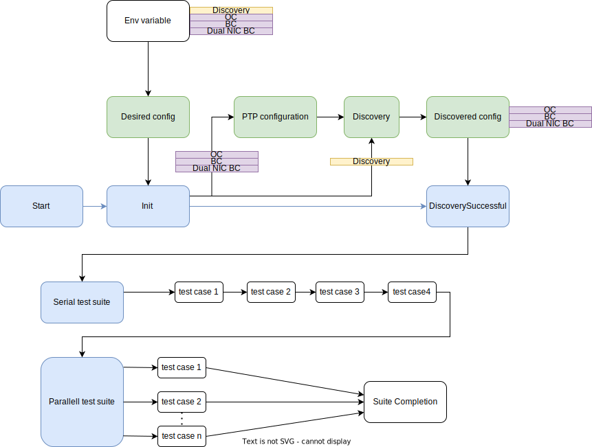

# Conformance tests
## Running the tests
To run the conformance tests, first set the following environment variables:
- **KUBECONFIG**: this is the path to the openshift kubeconfig 
- **PTP_TEST_MODE**: this is the desired mode to run the tests. Choose between: Discovery, OC, BC or DualNICBC. See below for an explanation for each mode.
- **DISCOVERY_MODE**: This is a legacy option and is equivalent to setting "Discovery" option in the PTP_TEST_MODE environment variable

Then run the following command:
```
make functests
```
So for instance to run in discovery mode the command line could look like this:
```
KUBECONFIG="/home/user/.kube/config" PTP_TEST_MODE=Discovery make functests
```

## PTP test modes
The type of clock to test is indicated by selecting a PTP test mode. The mode selection also determines which test are executed.
### Discovery
This mode assumes that one or more valid ptpconfig objects are configured in the openshift-ptp namespace. The test parses the ptpconfig objects and automatically determines the type of clock to test. Currently able to detect OC, BC and DualNICBC configurations.
### OC
This mode needs a multinode cluster to run. One node is selected to act as a Master. Another node is selected to act as a slave Ordinary clock. The test suite then tries the combination of all the interfaces for all the nodes to find the first master/slave pair signalling a "foreign master" in the logs.  
### BC
Not Implemented yet
### DualNICBC
Not Implemented yet
## Test mode discovery workflow 
The Test mode discovery workflow is as follows:


 

 ### States
 - **Desired config**: the desired mode is selected at this point. The choices are Discovery, OC, BC and DualNICBC 
 - **PTP configuration**: if OC, BC or DualNICBC modes are selected, a valid default configuration is configured automatically. The output of the configuration is 1 or 2 ptpconfig objects in the openshift-ptp. If Discovery mode is selected, this configuration step is skipped.
 - **Discovery**: the ptpconfig installed in the openshift-ptp namespace are analysed to determine which type of clocks they represent, either OC, BC or DualNICBC. This step is the same whether the configuration was configured by the test suite (OC, BC, DualNICBC) or by the user (Discovery). If the ptpconfigs are valid and a type of clock can be determined successfully, then discovery is successful and the corresponding test are executed.
    