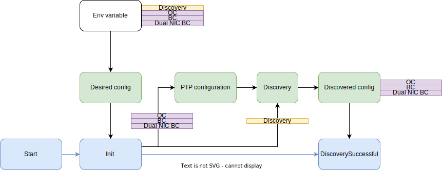

# Conformance tests

## Prerequisite(s)

Install Ginkgo v2 CLI following the [Migration Guide](https://onsi.github.io/ginkgo/MIGRATING_TO_V2)

## Running the tests
To run the conformance tests, first set the following environment variables:
- **PTP_LOG_LEVEL**: sets the log level (defaults to info), valid values are:  trace, debug, info, warn, error, fatal, panic
- **KUBECONFIG**: this is the path to the openshift kubeconfig 
- **PTP_TEST_MODE**: this is the desired mode to run the tests. Choose between: Discovery, OC and BC. See below for an explanation for each mode.
- **DISCOVERY_MODE**: This is a legacy option and is equivalent to setting "Discovery" option in the PTP_TEST_MODE environment variable
- **ENABLE_TEST_CASE**: This is an option to run the long running tests separated by comma. For example, to run reboot test, `ENABLE_TEST_CASE=reboot` shall be used.
- **SKIP_INTERFACES**: passes a list of interfaces to be skipped in the form "eno1,ens2f1" `SKIP_INTERFACES="eno1,ens2f1"`
- **KEEP_PTPCONFIG**: if set to true, the test script will not delete the ptpconfig it automatically created. If set to false, it will delete them. The ptpconfigs are deleted by default. For instance `KEEP_PTPCONFIG=true`
- **MAX_OFFSET_IN_NS**: maximum offset in nanoseconds between a master and a slave clock when testing clock accuracy. Default is 100
- **MIN_OFFSET_IN_NS**: minimum offset in nanoseconds between a master and a slave clock when testing clock accuracy. Default is -100

Then run the following command:
```
make functests
```
So for instance to run in discovery mode the command line could look like this:
```
KUBECONFIG="/home/user/.kube/config" PTP_TEST_MODE=Discovery make functests
```

To run all the tests
```
KUBECONFIG="/home/usr/.kube/config" ENABLE_TEST_CASE=reboot PTP_TEST_MODE=Discovery make functests
```

To run all the tests with a container:
```
docker run -e PTP_TEST_MODE=<TEST MODE> -e ENABLE_TEST_CASE=<EXTRA TEST CASES> -v <KUBECONFIG PATH>:/tmp/config:Z -v <OUTPUT DIRECTORY PATH>:/output:Z <IMAGE>
```
for example: 
```
docker run -e PTP_TEST_MODE=OC -e ENABLE_TEST_CASE=reboot -v /home/usr/.kube/config.3nodes:/tmp/config:Z -v .:/output:Z quay.io/redhat-cne/ptp-operator-test:latest
```

## Run SOAK test

Soak tests are configurable through the test configuration file as YAML file stored at location `test/conformance/config/ptptestconfig.yaml`. These tests run in parallel.

Manually the config can be passed also with the environment parameter (with absolute path of the config file) this way.
```
  PTP_TEST_CONFIG_FILE=ptptestconfig.yaml make functests
```

`global` field `enablecontinuous` controls whether the parallel test suite would execute or not.
Each test can be configured separately and can be enabled or disabled, however `enablecontinuous` field overrides that configuration.

### Event monitoring: OS Clock state monitoring
This test monitors the state of the os clock synchronized by the clock under test using the PTP fast event framework.
The following parameters in the PTP test config file (PTP_TEST_CONFIG_FILE=ptptestconfig.yaml) customize this test:
- setting the min and max os clock offsets. Dipping below the min offset or juimping above the max offset should trigger a FREERUN event. Staying between min and max offset should trigger a LOCKED event to be sent: 
```
global:
 maxoffset: 500
 minoffset: -500
```

- The `slave_clock_sync` section configures the test enable status (enable), duration (duration field) and max tolerated number of loss of sync (failure_threshold)
```
  slave_clock_sync:
    spec:
      enable: true
      duration: 5
      failure_threshold: 10
    desc: "The test measures number of PTP time sync faults, and fails if >0"
```
The test suite deploys a ptp events consumer sidecar to test events

### Cpu Usage test case configuration
The CPU usage test case will run for the "duration" minutes or until a number (`failure_threshold`) of cpu usage threshold has been reached.
These are the parameters that can be configured for the cpu usage soak test case:
```
  cpu_utilization:
    spec:
      enable: true
      duration: 60
      failure_threshold: 3
      custom_params:
        prometheus_rate_time_window: "60s"
        node:
          cpu_threshold_mcores: 100
        pod:
          - pod_type: "ptp-operator"
            cpu_threshold_mcores: 60

          - pod_type: "linuxptp-daemon"
            cpu_threshold_mcores: 10

          - pod_type: "linuxptp-daemon"
            container: "cloud-event-proxy"
            cpu_threshold_mcores: 30
```
`<pod-type>` must be either `"ptp-operator"` or `"linuxptp-daemon"`, and at least one of "node" or "pod" cpu thresholds must be configured, but it's also possible to set both.
+ `prometheus_rate_time_window` is a string with a duration for the prometheus' rate function. Examples: "60s", "1m30s", "5m"...
+ `node` allows to set the maximum cpu usage for all ptp pods deployed on each node.
+ `pod` allows two types of configs:
  - If no "container" is set, the threshold applies to the sum of the cpu usage of all the containers of each pod of that type.
  - If "container" is set, the cpu threshold will be applied only for that specific container on each pod (type). The other containers' cpu usage of that pod type will be ignored/won't be checked.

It's important to note that there's no way to target individual pods here, so these thresholds will apply to every pod/container of that type deployed in the cluster.
This means that if there are two ptp-capable nodes in the cluster, there will be one pod of the linuxptp-daemon on each. Thus, the threshold (30mC) for the "cloud-event-proxy" will apply to that container on both pods.

Config examples:

Example 1: The sum of cpu usages of all ptp pods deployed on each node must be lower than 100mC during 60 minutes. Test case fails if the cpu usage threshold has been reached/surpassed 3 times.
```
  cpu_utilization:
    spec:
      enable: true
      duration: 60
      failure_threshold: 3
      custom_params:
        prometheus_rate_time_window: "60s"
        node:
          cpu_threshold_mcores: 100
```

Example 2: The sum of cpu usage of all the containers of the ptp-linuxptp-daemon pod should be lower than 80mC. The ptp-operator pod cpu usage is ignored. There's no check of per-node cpu usage either.
```
  cpu_utilization:
    spec:
      enable: true
      duration: 60
      failure_threshold: 3
      custom_params:
        prometheus_rate_time_window: "60s"
        pod:
          - pod_type: "linuxptp-daemon"
            cpu_threshold_mcores: 80
```

Example 3: On each ptp-linuxptp-daemon pod deployed in the cluster, the cpu usage of the cloud-event-proxy and linuxptp-daemon-container containers must be lower than 30 and 40 respectively.
```
  cpu_utilization:
    spec:
      enable: true
      duration: 60
      failure_threshold: 3
      custom_params:
        prometheus_rate_time_window: "60s"
        pod:
          - pod_type: "linuxptp-daemon"
            container: "cloud-event-proxy"
            cpu_threshold_mcores: 30
          - pod_type: "linuxptp-daemon"
            container: "linuxptp-daemon-container"
            cpu_threshold_mcores: 40
```

Example 4: All possible combinations.
Max cpu usage per node: 100mC
Max cpu usage for the ptp-operator's pod: 30mC
Max cpu usage for the linuxptp-daemon pod: 80mC
Max cpu usage for the cloud-event-proxy on each linuxptp-daemon pod: 30mC
Max cpu usage for the linuxptp-daemon-container on each linuxptp-daemon pod: 40mC
```
  cpu_utilization:
    spec:
      enable: true
      duration: 60
      failure_threshold: 3
      custom_params:
        prometheus_rate_time_window: "60s"
        node:
          cpu_threshold_mcores: 100
        pod:
          - pod_type: "ptp-operator"
            cpu_threshold_mcores: 30

          - pod_type: "linuxptp-daemon"
            cpu_threshold_mcores: 80

          - pod_type: "linuxptp-daemon"
            container: "cloud-event-proxy"
            cpu_threshold_mcores: 30

          - pod_type: "linuxptp-daemon"
            container: "linuxptp-daemon-container"
            cpu_threshold_mcores: 40
```
## Labelling test nodes manually in discovery mode
In Discovery mode, the node holding the clock under test is indicated via a label
To indicate a node with a BC configuration, label it with 
```
 oc label  node <nodename>    ptp/clock-under-test=""
```
In addition to the label, a valid user provided ptpconfig must be present corresponding to the labeled node

example BC ptp config:
```yaml
apiVersion: ptp.openshift.io/v1
kind: PtpConfig
metadata:
  managedFields:
  - apiVersion: ptp.openshift.io/v1
    fieldsType: FieldsV1
    fieldsV1:
      f:spec:
        .: {}
        f:profile: {}
        f:recommend: {}
    manager: __debug_bin
    operation: Update
    time: "2022-06-13T22:27:54Z"
  name: test-bc-master
  namespace: openshift-ptp
spec:
  profile:
  - name: test-bc-master
    phc2sysOpts: -a -r
    ptp4lConf: |-
      [global]
      ptp_dst_mac 01:1B:19:00:00:00
      p2p_dst_mac 01:80:C2:00:00:0E
      domainNumber 24
      logging_level 7
      boundary_clock_jbod 1
      [ens2f0]
      masterOnly 0
      [ens2f1]
      masterOnly 1
    ptp4lOpts: "-2"
    ptpSchedulingPolicy: SCHED_OTHER
    ptpSchedulingPriority: 65
  recommend:
  - match:
    - nodeLabel: ptp/clock-under-test
    priority: 5
    profile: test-bc-master

```
## PTP test modes
The type of clock to test is indicated by selecting a PTP test mode. The mode selection also determines which test are executed.
### Discovery mode
This mode assumes that one or more valid ptpconfig objects are configured in the openshift-ptp namespace. The test parses the ptpconfig objects and labels to automatically determines the type of clock to test. Currently able to detect OC, BC and Dual NIC BC configurations. GrandMasters or Boundary clock slaves are not detected.

In Discovery mode, no auto-configuration is performed and no clocks are created. The existing clocks are just tested.
### Auto-Configured modes
The following modes need a multinode or single node cluster to run:
- with a multi-node cluster, One node is selected to act as a Master. Another node is selected to act as a slave Ordinary clock. The test suite uses the L2 discovery mechanism to discover the cluster connectivity and create a graph of the network. The graph is resolved to find the best OC, or BC configuration. 
- with a single node cluster, the L2 mechanism instead reports interfaces on which PTP ethernet frames are received. The PTP frames received are assumed to be from ax external Grand master. The test suite uses one of the interfaces identified as receiving ptp GM frames and create the ordinary or boundary clock with it. 

#### OC
The OC configurations includes a grandmaster providing a clock signal to a slave ordinary clock. See diagram below:


#### BC
Several boundary clock scenarios are possible, dependent on minimum hardware configuration.
In the optimal scenario, the openshift cluster needs to be at least connected to 2 separate LANs. These LANs are realized with the help of VLANs or other technologies. The following configuration is tested if 2 LANs are detected in the cluster. Note that the cluster needs to have at least one NIC which ports are connected on the 2 separate LANs, as shown below:


If only one LAN is available, the following configuration is tested. In this case, the synchronization of the slave ordinary clocks cannot be tested


#### DualNICBC

Several dual NIC boundary clock scenarios are possible, dependent on minimum hardware configuration.
In the optimal scenario, the openshift cluster needs to be at least connected to 3 separate LANs. These LANs are realized with the help of VLANs or other technologies. The following configuration is tested if 3 LANs are detected in the cluster.


If only one LAN is available, the following configuration is tested. In this case, the synchronization of the slave ordinary clocks cannot be tested


#### External Grandmaster support

It is also possible to use an existing Grandmaster to synchronize clock to. This is specified by setting the EXTERNAL_GM environement variable. The PTP test mode is configured according to the following table:

| PTP_TEST_MODE      | EXTERNAL_GM | MODE |
| ----------- | ----------- |---------| 
| OC      | false/not set       | OC + self configured GM |
| BC      | false/not set       | BC + self configured GM |
| Dual NIC BC      | false/not set       |  Dual NIC BC + self configured GM |
| OC      | true       | OC + discovered External GM |
| BC      | true       | BC + discovered External GM |
| Dual NIC BC      | true       |  Dual NIC BC + discovered External GM |
| Discovery     | true/false       | Discovered Clock + discovered External GM |

##### External GM and OC

##### External GM and BC


if not enough resources for slaves:


##### External GM and DualNIC BC


if not enough resources for slaves:


## Test mode discovery workflow 
The Test mode discovery workflow is as follows:


 

 ### States
 - **Desired config**: the desired mode is selected at this point. The choices are Discovery, OC and BC.
 - **PTP configuration**: if OC, BC modes are selected, a valid default configuration is configured automatically. The output of the configuration is 1 or 2 ptpconfig objects in the openshift-ptp. If Discovery mode is selected, this configuration step is skipped.
 - **Discovery**: the ptpconfig installed in the openshift-ptp namespace are analysed to determine which type of clocks they represent, either OC, BC. This step is the same whether the configuration was configured by the test suite (OC, BC) or by the user (Discovery). If the ptpconfigs are valid and a type of clock can be determined successfully, then discovery is successful and the corresponding test are executed.
# Host based L2 discovery 
The rapid discovery of L2 hosts is realized by probing the network with test Ethernet frames. See https://github.com/test-network-function/l2discovery


Each openshift node reports L2 connectivity with a JSON log as shown below. The Json represent a map ordered by ethertype -> local interface -> remote mac address. So for each local interface it lists the MAC addresses that are received per ethertype. We are using the "experimental" ethertype to generate the probe packets (0x88b5):

```json
{
  "88b5": {
    "eno5np0": {
      "Local": {
        "IfName": "eno5np0",
        "IfMac": {
          "Data": "F4:03:43:D1:70:A0"
        },
        "IfIndex": 2
      },
      "Remote": {
        "F4:03:43:D1:40:F0": true,
        "F4:03:43:D1:65:D0": true
      }
    },
    "eno6np1": {
      "Local": {
        "IfName": "eno6np1",
        "IfMac": {
          "Data": "F4:03:43:D1:70:A8"
        },
        "IfIndex": 4
      },
      "Remote": {
        "48:DF:37:BC:F0:E1": true,
        "48:DF:37:BC:F4:41": true,
        "F4:03:43:D1:40:F8": true,
        "F4:03:43:D1:65:D8": true
      }
    },
    "ens3f0": {
      "Local": {
        "IfName": "ens3f0",
        "IfMac": {
          "Data": "48:DF:37:BC:F1:64"
        },
        "IfIndex": 6
      },
      "Remote": {
        "48:DF:37:BC:F0:E0": true,
        "48:DF:37:BC:F4:40": true
      }
    },
    "ens3f1": {
      "Local": {
        "IfName": "ens3f1",
        "IfMac": {
          "Data": "48:DF:37:BC:F1:65"
        },
        "IfIndex": 8
      },
      "Remote": {
        "48:DF:37:BC:F0:E1": true,
        "48:DF:37:BC:F4:41": true,
        "F4:03:43:D1:40:F8": true,
        "F4:03:43:D1:65:D8": true
      }
    }
  }
}
```

## Solving Clock configuration from discovered L2 topology

To solve the problem of finding an optimal ptp configuration, we are using a homemade solver based on the backtracting algorithm modified to take into account multiple level of successive constraints

As an example, the representation of the algorithm to solve the BC configuration in a multinode scenario is the following:


Note the labels, p0, p1. These represent the interface number in the algorithm and also the step. in step 0, we can check constraints for interface p0 only. In step 1, we can check constraints for interfaces p0 and p1 if needed.
The representation in the code of the visual representation of the algorithm represented by the picture above is the following:

```
	BCAlgo := [][][]int{
		{{int(StepNil), 0, 0}},            //step nil
		{{int(StepSameNic), 2, 0, 1}},     //step0 checks that p0 and p1 are in the same NIC
		{{int(StepSameIsland2), 2, 1, 2}}, //step1 checks that p1 and p2 are in the same island
	}
```

each step in the algorithm means:

```
{<constraint to check>, <number of parameters to the function>, <interface0>, ..., interfaceN}}
```
note: parameter0 ... parameterN are integers representing an interface. 0 means p0, 1 means p1, etc...

